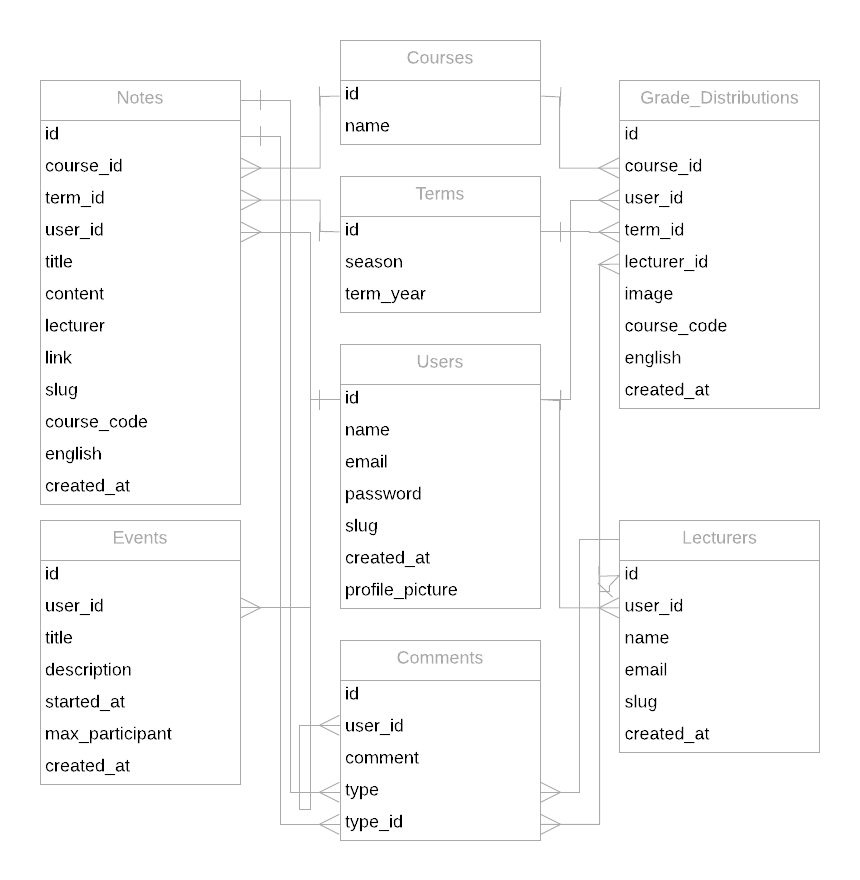

Developer Guide
=================

*****************
Database Design
*****************

For the database, we used 6 main tables and 4 additional tables.

The main tables are
**users, notes, events, comments, lecturers** and **grade distributions**.

The other tables used are **courses** and **terms** for providing course and
term information for the grade distributions and notes tables. **roles**
and **user roles** tables for checking if the user is admin, moderator
or a regular user.

The main diagram can be seen below.

Main information kept in each table can be seen in the diagram.

We kept courses and terms information in our database and retrieved
this option as a dropdown menu each time a new note or a grade
distribution is added. Therefore, both notes and grade distributions contain
term and course reference keys.

User id is kept in every main table to track which user created a new entry.

Each grade distributions is associated with a lecturer so it each entity contains a
referencing lecturer id.

In comments, we held a type variable. This type variable is an enum with values "lecturers" and
"notes". The type id references the id in the table defined with the type variable. For example,
if type is "notes" and type id is 35, then this comment is a comment of the note with the id 35.
Checks relating the type and type id are done in backend.

We also have the additional diagram for checking user roles.

.. figure:: ../../Screenshots/Diagrams/DB-Diagram2.png
      :scale: 45 %
      :alt: Event creation form.

It's as simple as it looks. The users role is checked in the user roles table, by
retrieving the corresponding role from the roles table.

******
Code
******

Since we separated backend and frontend, you can check the guides separately using the links given below:

.. toctree::
   :maxdepth: 1

   Backend/index
   Frontend/index
